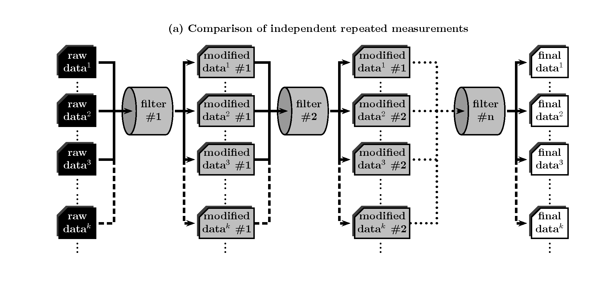
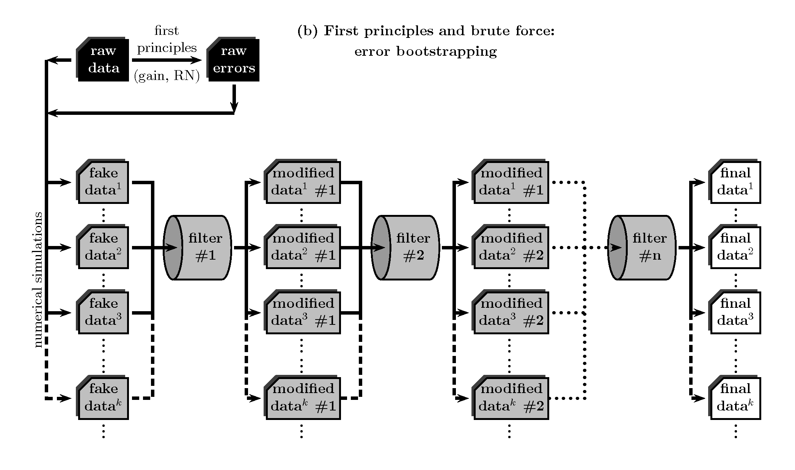
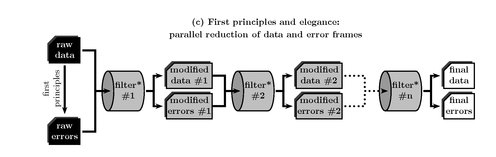
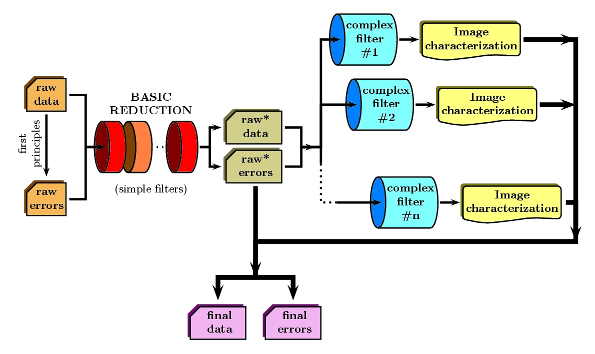
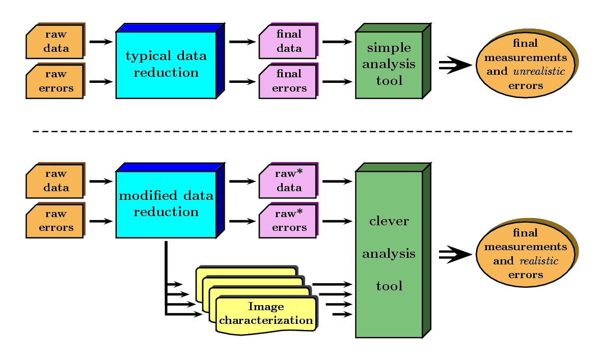
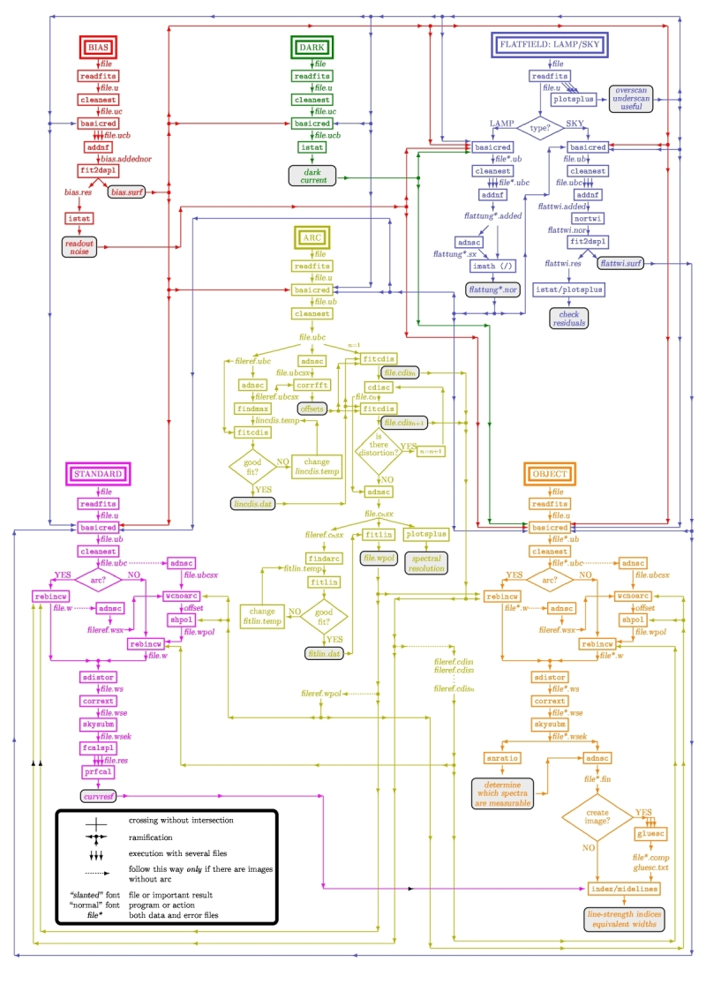

High Level description of the Data Reduction Pipeline
=====================================================

This is an overall description of the relevant processes involved in the Data Reduction Pipeline of 
EMIR (basically from the point of view of the astronomers). In this sense, the information 
here contained follows the contents of the `EMIR Observing Strategies 
<http://guaix.fis.ucm.es/projects/emir/attachment/wiki/private/
HighLevel/EMIR_ObservingStrategies.pdf>`_ document.

The reason for a data reduction
*******************************

The data reduction process, aimed to minimize the impact of data acquisition 
imperfections on the measurement of data properties with a scientific meaning for the 
astronomer, is typically performed by means of arithmetical manipulations of data 
and calibration frames.

The imperfections are usually produced by non-idealities of image the sensors: temporal noise, 
fixed pattern noise, dark current, and spatial sampling, among others. Although appropriate observational 
strategies can greatly help in reducing the sources of data biases, the unavoidable limited observation 
time that can be spent in each target determines the maximum signal-to-noise ratio in practice achievable.

Sources of errors
*****************

Common sources of noise in image sensors are separated into two categories:
 * **Random noise**: This type of noise is temporally random (it is not constant from frame to frame). 
   Examples of this kind of noise are the followings:
 
   * **Shot noise**: It is due to the discrete nature of electrons. Two main phenomena contribute 
     to this source of error: the random arrival of photo-electrons to the detector (shot noise of 
     the incoming radiation), and the thermal generation of electrons (shot noise 
     of the dark current). In both cases, the noise statistical distributions are 
     well described by a Poisson distribution. 
   
   * **Readout noise**: Also known as floor noise, it gives an indication of the minimum 
     resolvable signal (when dark current is not the limiting factor), and accounts for 
     the amplifier noise, the reset noise, and the analog-to-digital converter noise.

 * **Pattern noise**: it is usually similar from frame to frame (i.e. it is stable 
   in larger timescales), and cannot be reduced by frame averaging. 
   Pattern noise is also typically divided into two subtypes:
    
   * **Fixed Pattern Noise** (FPN):This is the component of pattern 
     noise measured in absence of illumination. It is possible to compensate 
     for FPN by storing the signal generated under zero illumination and 
     subtracting it from subsequent signals when required.
   * **Photo-Response Non-Uniformity** (PRNU): It is the component of pattern 
     noise that depends on the illumination (e.g. gain non-uniformity). 
     A first approximation is to assume that its contribution is a (small) 
     fraction, f_PRNU, of the number of photo-electrons, |Ne|. 
     Under this hypothesis, and considering in addition only the shot 
     noise due to photo-electrons, the resulting variance of the combination 
     of both sources of noise would be expressed as:
  
     |Ne| + (|fprnu| * |Ne|)\ :sup:`2`\ . 
     
     Thus, the worst case is obtained when |Ne| approaches 
     the pixel full-well capacity.
     
.. |Ne| replace::  N\ :sub:`e`\
.. |fprnu| replace::  f\ :sub:`PRNU`\ 

It is important to note that the correction of data biases, like the FPN, 
also constitutes, by itself, a source of random error, since they are 
performed with the help of a limited number of calibration images. In 
the ideal case, the number of such images should be large enough to guarantee 
that these new error contributors are negligible in comparison with the 
original sources of random error.

The treatment of errors in the data reduction process
*****************************************************

Three methods to quantify random errors
+++++++++++++++++++++++++++++++++++++++

In a classic view a typical data reduction pipeline can be considered as 
a collection of filters, each of which transforms input images into new output 
images, after performing some kind of arithmetic manipulation and making 
use of additional measurements and calibration frames when required. 
Under this picture, three different approaches can in principle be 
employed to determine random errors in completely reduced images.

Comparison of independent repeated measurements
-----------------------------------------------
 
This is one of the simplest and most straightforward ways to 
estimate errors, since, in practice, errors are not computed 
nor handled during the reduction procedure, but through the 
comparison of the end products of the data processing. The only 
requirement is the availability of a non too small number of 
independent measurements. Although as such can be considered even 
the flux collected by each **independent** pixel in a 
detector (for example when determining the sky flux error in direct 
imaging), in most cases this method requires the comparison of 
different frames. For that reason, and given that for 
many purposes it may constitute an extremely expensive method in 
terms of observing time, its applicability on a general situation 
seems rather unlikely.

First principles and brute force: error bootstrapping
-----------------------------------------------------

Making use of the knowledge concerning how photo-electrons are generated (
expected statistical distribution of photon arrival into each pixel, detector 
gain and read-out noise), it is possible to generate an error image associated 
to each raw-data frame. In this sense, typically one can compute such error 
image (in number of counts, ADU, ---analogic to digital number---) as:

  sigma,,A,,(i,j)^2^ = 1/g A(i,j) + [ |fprnu| * A(i,j)]^2^ + RN^2^(i,j)

where A(i,j) is the signal (after the bias-level subtraction) in the pixel (i,j) of a given two-dimensional image (in ADU), g is the gain of the A/D converter (in e^-^/ADU), f_PRNU is the photo-response non-uniformity factor discussed above, and RN is the read-out noise (in ADU). Note that the apparent dimensional inconsistency of the previous expression is not real, and arises from the fact that one of the properties of the Poisson distribution is that its variance is numerically equal to the mean expected number of events. By means of error bootstrapping via Monte Carlo simulations, simulated initial data frames can be generated and be completely reduced as if they were real observations. In order to achieve this task, it is possible to use

A_simul(i,j)=A(i,j) + SQRT(2) * sigma,,A,,(i,j) * SQRT(-LN(1-z,,1,,) * COS (2*PI*z,,2,,)

where A_simul(i,j) is a new instance of the initial raw-data frame, and z,,1,, and z,,2,, are two random numbers in the range  [0,1). Note that the second term in the right hand side of the previous expression introduces Gaussian noise in each pixel. The comparison of the measurements performed over the whole set of reduced simulated observations provides then a good estimation of the final errors. However, and although this method overcome the problem of wasting observing time, it can also be terribly expensive, but now in terms of computing time.

First principles and elegance: parallel reduction of data and error frames 
--------------------------------------------------------------------------

Instead of wasting either observing or computing time, it is also possible to 
feed the data reduction pipeline with both, the original raw-data frame and its 
associated error frame (computed from first principles), and proceed only once 
throughout the whole reduction process. In this case every single arithmetic manipulation 
performed over the data image must be translated, using the law of 
propagation of errors, into parallel manipulations of the error image. 

Unfortunately, typical astronomical data reduction packages (e.g. Iraf, Midas, etc.) 
do not consider random error propagation as a **by default** operation and, thus, 
some kind of additional programming is unavoidable.

Error correlation: a real problem
++++++++++++++++++++++++++++++++++++

Although each of the three methods described above is suitable of being 
employed in different circumstances, the third approach is undoubtedly the one that, 
in practice, can be used in a more general situation. In fact, once the appropriate data 
reduction tool is available, the parallel reduction of data and error frames 
is the only way to proceed when observing or computing time demands 
are prohibitively high. However, due to the unavoidable fact that the information 
collected by detectors is physically sampled in pixels, this approach collides with a 
major problem: errors start to be correlated as soon as one introduces image 
manipulations involving rebinning or non-integer pixel shifts of data. 

A naive use of the analysis tools would neglect the effect of covariance terms, leading 
to dangerously underestimated final random errors. Actually, this is likely the 
most common situation since, initially, the classic reduction operates as 
a black box, unless specially modified for the contrary. The figure below 
shows a very simple example which illustrates this problem. Unfortunately, as 
soon as one accumulates a few reduction steps involving increment of correlation 
between adjacent pixels (e.g. image rectification when correcting for geometric 
distortions, wavelength calibration into a linear scale, etc.), the number of 
covariance terms starts to increase too rapidly to make it feasible the 
possibility of stacking up and propagate all the new coefficients for every 
single pixel of an image.

.. image:: images/correlation.jpg
   :width: 800
   :alt: Correlation

In this simple example we illustrate the problem of error correlation when reducing data. Assuming we have a linear detector, composed by a set of consecutive pixels, in an ideal situation we are considering that all the signal of a given object (100 +/- 10 counts) is received in a single pixel (we are ignoring additional sources of error, like read-out noise). However, a small shift in the focal plane may imply that the observed signal is distributed in two adjacent pixels. After reducing the data while restoring the image, and propagating the observed errors in each pixel, the error in the total flux F is computed using the errors in each pixel and following the law of combination of errors. But if we use the incomplete expression, neglecting the covariance terms, we get an unrealistic (and underestimated) error.

A modified reduction procedure
++++++++++++++++++++++++++++++

Obviously, the problem can be circumvented if one prevents its emergence, i.e. if one does not allow the data reduction process to introduce correlation into neighbouring pixels before the final analysis. In other words, if all the reduction steps that lead to error correlation are performed in a single step during the measurement of the image properties with a scientific meaning for the astronomer, there are no previous covariance terms to be concerned with. Whether this is actually possible or not may depend on the type of reduction steps under consideration. In any case, a change in the philosophy of the classic reduction procedure can greatly help in alleviating the problem. The core of this change consists in considering the reductions steps that originate pixel correlation as filters that **do not necessarily** take input images and generate new versions of them after applying some kind of arithmetic manipulation, but as filters that properly **characterize** the image properties, without modifying those input images.

More precisely, the reduction steps can be segregated in two groups:

 * **Simple filters**, which do not require data rebinning nor non-integer pixel shifts of data.

 * **Complex filters**, those suitable of introducing error correlation between adjacent pixels.

The former may be operated like in a classic reductions, since their 
application do not introduce covariance terms. However, the complex steps are only 
allowed to determine the required image properties that one would need to actually 
perform the correction. For the more common situations, these characterizations may 
be simple polynomials (in order to model geometric distortions, non-linear wavelength 
calibration scales, differential refraction dependence with wavelength, etc.). 
Under this view, the end product of the modified reduction procedure is constituted 
by a slightly modified version of the raw data frames after quite simple arithmetic 
manipulations (denoted as **raw data**' and **raw errors**' in the previous figure), and 
by an associated collection of image characterizations.

Modus Operandi
++++++++++++++

Clearly, at any moment it is possible to combine the result of the partial reduction 
after all the linkable simple steps, with the information achieved through all the 
characterizations derived from the complex steps, to obtain the same result than 
in a classic data reduction (thick line in the previous figure). 

However this is not the only option. Instead of trying to obtain completely reduced images 
ready for starting the analysis work, one can directly feed a **clever analysis tool** with the end products of the modified reduction procedure, as depicted in this figure:

Obviously, this clever analysis tool has to perform its task taking into account that some reductions steps have not been performed. For instance, if one considers the study of a 2D spectroscopic image, the analysis tool should use the information concerning geometric distortions, wavelength calibration scale, differential refraction, etc., to obtain, for example, an equivalent width through the measurement in the partially reduced (uncorrected for geometric distortions, wavelength calibration, etc.) image. 

Image distortions and errors
++++++++++++++++++++++++++++

Interestingly, the most complex reduction steps are generally devoted to compensate for image imperfections that can be associated with geometric distortions. For illustration, and using the typical problems associated to the reduction of long-slit spectroscopy, we can summarize the most common image distortions in the following types:

 * *Optical distortion*: Along the slit (spatial) direction, this distortion would be equivalent to a geometric distortion in imaging mode. Furthermore, this distortion also includes any possible spatial distortion of the spectra in the detector (i.e. spectra of punctual objects not following a line parallel to the detector rows) which is not due to the slit in use (orientation or shape defects; see below) or to refraction effects. The way to deduce the distortion map (note that it is a 3D map, accounting the third dimension for the distortion of the spectra) is by observing punctual objects in different positions of the focal plane. This can be accomplished by observing lamp arc spectra through special masks with evenly distributed holes along a focal plane column.

 * *Slit distortion*: This distortion accounts for the potential distortions introduced by the use of an imperfect slit. This includes: a) small variations in the slit width along the slit direction and, b) the difference in slit orientation with respect to the vertical direction in the detector plane.

 * *Wavelength distortion*: Commonly referred as wavelength calibration, this distortion accounts for the fact that the relation between pixels and actual wavelengths along the dispersion direction, after the removal of the two previous distortions, is typically not linear.

 * *Differential refraction distortion*: In the absence of the three previous distortions, the dependence of atmospheric dispersion with wavelength produces that the spectrum of a punctual source does not follow a straight line parallel to the dispersion direction. This effect depends mainly on the zenith angle of the observation, the wavelength range, and the difference between the slit position angle and the parallactic angle (being the distortion maximum when both angles are the same, and zero if they are orthogonal). For these reasons, it is not possible to derive a general distortion map for a given instrument setup, but this kind of distortion must be corrected individually for each observed frame.

To accomplish a proper random error treatment, as previously described, it is necessary to manipulate the data using a new and distorted system of coordinates that must account for all the image distortions present in the data. These distortions should be easily mapped with the help of calibration images. The new coordinate system provides the correspondence between the expected scientific coordinate system (e.g. wavelength and 1D physical size, in spectroscopic observations) and the observed coordinate system (physical pixels). It is important to highlight that, in this situation, the error estimation should not be a complex task, since the analysis tool is supposed to be handling uncorrelated pixels.

The bottom line that can be extracted from the comparison of the different methods to estimate random errors in data reduction processes is the relevance of delaying the arithmetic manipulations involving the rebinning of the data until their final analysis.

.. note::
   In the case of EMIR, we will use the parallel reduction of data and error frames, 
   trying to combine the arithmetical manipulations implying signal rebinning into the fewer 
   steps as possible. In this way we hope to minimize the impact of error correlation. 
   If we have enough time, we can try to create software tools that perform the kind of 
   *clever analysis* we have previously described.

EMIR basic observing modes and strategies
=========================================

EMIR is offering two main observing modes:

 * **imaging**: FOV of 6.67 x 6.67 arcmin, with a plate scale of 0.2 arcsec/pixel. Imaging can be done through NIR broad-band filters Z, J, H, K, K_s, and a dataset of narrow-band filters (TBC).
 * **multi-object spectroscopy**: multi-slit mask with a FOV of 6.67 x 4 arcmin. Long-slit spectroscopy can be performed by placing the slitlets in adjacent positions.

We are assuming that a particular observation is performed by obtaining a set of images, each of which is acquired at different positions referred as offsets from the base pointing. In this sense, and following the notation used in [http://guaix.fis.ucm.es/projects/emir/attachment/wiki/private/HighLevel/EMIR_ObservingStrategies.pdf EMIR Observing Strategies], several situations are considered:
 * **'Telescope**'
 * **'Chopping**' (TBD if this option will be available): achieved by moving the GTC secondary mirror. It provides a 1D move of the order of 1 arcmin. The purpose is to isolate the source flux from the sky background flux by first measuring the total (Source+Background) flux and then subtracting the signal from the Background only.
 * **'DTU Offseting**': the Detector Translation Unit allows 3D movements of less than 5 arcsec. The purpose is the same as in the chopping case, **when the target is point-like**. It might also be used to defocus the target for photometry or other astronomical uses.

 * **'Dither**': it is carried out by pointing to a number of pre-determined sky positions, with separations of the order of 25 arcsec, using the GTC primary or secondary mirrors, or the EMIR DTU, or the Telescope. The purpose of this observational strategy is to avoid saturating the detector, to allow the removal of cosmetic defects, and to help in the creation of a sky frame.
  * **'Nodding**': pointing the Telescope alternatively between two or more adjacent positions on a 1D line, employing low frequency shifts and typical distances of the order of slitlet-lengths (it plays the same role as chopping in imaging).
  * **'Jitter**': in this case the source falls randomly around a position in a known distribution, with shifts typically below 10 arcsec, to avoid cosmetic defects.

Reduction steps for the Imaging Mode
====================================

**'Inputs:**'
{{{
Science frames
Offsets between them
Master Dark
Bad pixel mask (BPM)
Non-linearity correction polynomials
Master flat
Master background
Exposure Time (must be the same in all the frames)
Airmass for each frame
Detector model (gain, RN)
Average extinction in the filter
}}}

In near-infrared imaging it is important to take into account that the variations observed in the sky flux in a given image are due to real spatial variations of the sky brightness along the field of view, the thermal background, and intrinsic flatfield variations.

The master flatfield can be computed from the same science frames (for small targets) or from adjacent sky frames. This option, however, is not the best one, since the sky brightness is basically produced by a finite subset of bright emission lines, which SED is quite different from a continuous source. For this reason, most of the times the preferred master flatfield should be computed from twilight flats. On the other hand, systematic effects are probably more likely in this second approach. Probably it will be required to test both alternatives. The description that follows describes the method employed when computing the master flatfield from the same set of night images, at is based on the details given in [http://guaix.fis.ucm.es/projects/emir/attachment/wiki/private/HighLevel/scam_20001113.pdf SCAM reduction document], corresponding to the reduction of images obtained with NIRSPEC at Keck II.

A typical reduction scheme for imaging can be the following:

 * Data modelling (if appropriate/possible) and variance frame creation from first principles: all the frames
 * Correction for non-linearity: all the frames
   * Data: I,,linear,,(x,y)=I,,observed,,(x,y)*Pol,,linearity,,
   * Variances: sigma^2^,,linear,,(x,y)=[sigma_model(x,y)*Pol,,linearity,,]^2^+ [I,,observed,,(x,y)*Error_Pol,,linearity,,]^2^
 * Dark correction: all the frames
   * Data: I,,dark,,(x,y)=I,,linear,,(x,y)-Master_Dark(x,y)
   * Variances: sigma^2^,,dark,,(x,y)=[sigma,,linear,,(x,y)]^2^ + [Error_Master_Dark(x,y)]^2^
 * Master flat and object mask creation: __a loop starts__

**'First iteration**': computing the object mask, refining the telescope offsets, QC to the frames.

- No object mask is used (it is going to be computed).[[BR]]
- All the dark-corrected science frames are used.[[BR]]
- No variances computation.[[BR]]
- BPM is used.

 a. Flat computation (1st order): Flat^1st^(x,y)=Comb[I,,dark,,(x,y)]/Norm
   * Combination using the median (alternatively, using the mean).
   * No offsets taken into account.
   * Normalization to the mean.
 b. Flat correction (1st order): I,,flat,,^1st^(x,y)= I,,dark,,(x,y)/Flat^1st^(x,y)
 c. Sky correction (1st order): I,,sky,,^1st^(x,y) = I,,flat,,^1st^(x,y)-Sky
   * Sky is computed and subtracted in each array channel (mode of all the pixels in the channel), in order to avoid time-dependent variations of the channel amplifiers.
   * BPM is used for the above sky level determination.
 d. Science image (1st order): Science^1st^(x,y)=Comb[I,,sky,,^1st^(x,y)]
   * Combination using the median.
   * Taking telescope offsets into account.
   * Extinction correction is performed to each frame before combination: *10^k X/2.5^, being X the airmass.
   * Rejection of bad pixels during the combination (alternatively, asigma-clipping algorithm).
 e. Object Mask (1st order): SExtractor[Science^1st^(x,y)] -> Obj_Mask^1st^(x,y)
   * High DETECT_THRESH (for detecting only the brightest objects).
   * Saturation limit must be carefully set (detected objects must not be saturared).
 f. Offsets refinement:
   * Objects are also found in the sky-corrected frames: SExtractor[I_sky^1st^(x,y)]
   * All the objects detected in the combined science image are also identified in each sky-corrected frame. For doing that, the position of each source from the combined image is converted into positions in the reference system of each frame I_sky^1st^(x,y). The telescope offsets are used for a first estimation of the source position in the frame. A TBD cross-correlation algorithm finds the correct source position into a window of size S around the estimated position. The new improved offsets are computed for each source in each frame.
   * The differences between the improved offsets (OFFX,OFFY) and the telescope (nominal) offsets (OFFX^tel^,OFFY^tel^) are computed for each object in each frame.
   * The differences between both sets of offsets are plotted for all the objects vs. Object Number, ordered by brightness.
   * The mean values of these differences (weighting with object brightness) are computed, making an approximation to integer values. These values represent the average displacement of the true offsets of the frame relative to the nominal telescope offsets.
   * If the estimated refined offsets are very different from the nominal values, the Science^1st^(x,y) image is computed again, using the refined offset values. A llop starts from step d) to f), until the offsets corrections are less than a TBD threshold value for the corresponding frame.
 g. Quality Control for the science frames:
   * The brightest objects detected in the Obj_Mask^1st^(x,y) are selected (N~5 objects). They must appear in more than two frames.
   * The FLUX_AUTO and the FWHM of each selected object are computed in each frame.
   * The FLUX_AUTO*10^k X/2.5^ and FWHM are plotted vs. frame number.
   * The median values of FLUX_AUTO*10^k X/2.5^ and FWHM along all the frames are computed for each object, as well as their standard deviations.
   * A sigma-clipping algorithm will select those frames with more than N/2 objects (TBD) lying +/- 1 sigma above/below the median value of FLUX_AUTO*10^k X/2.5^. These frames will be flagged as **non-adequate** for the creation of the final science frame.
   * All those frames with FWHM lying n times sigma above their median value or m times sigma below it are also flagged as **non-adequate**. Notice that m and n must be different (FWHM values better than the median must be allowed).
   * The **non-adequate** frames are not used for generating the final science frame. They will be avoided in the rest of the reduction.
   * A QC flag will be assigned to the final science image, depending on the number of frames finally used in the combination. E.g, QC_GOOD if between 90-100% of the original set of frames are **adequate**, QC_FAIR between 70-90%, QC_BAD below 70% (the precise numbers TBD).

**'Second iteration**'

- Obj_Mask^1st^(x,y) is used for computing the flatfield and the sky.[[BR]]
- Only those dark-corrected science frames that correspond to **adequate** frames are used.[[BR]]
- No variances computation.[[BR]]
- BPM is also used.

 a. Flat computation (2nd order): Flat^2nd^(x,y)=Comb[I,,dark,,(x,y)]/Norm
   * Combination using the median (alternatively, using the mean).
   * The first order object mask is used in the combination.
   * No offsets taken into account in the combination, although they are used for translating positions in the object mask to positions in each individual frame.
   * Normalization to the mean.
 b. Flat correction (2nd order): I,,flat,,^2nd^(x,y)= I,,dark,,(x,y)/Flat^2nd^(x,y)
 c. Sky correction (2nd order): I,,sky,,^2nd^(x,y) = I,,flat,,^2nd^(x,y)-Sky^new^(x,y)
   * Sky^new^ is computed as the average of m (~ 6, TBD) I,,flat,,^2nd^(x,y) frames, near in time to the considered frame, taking into account the first order object mask and the BPM.
   * An array storing the number of values used for computing the sky in each pixel is generated (weights array).
   * If no values are adequate for computing the sky in a certain pixel, a zero is stored at the corresponding position in the weights array. The sky value at these pixels is obtained through interpolation with the neighbouring pixels.
 d. Science image (2nd order): Science^2nd^(x,y)=Comb[I,,sky,,^2nd^(x,y)]
   * Combination using the median.
   * Taking the refined telescope offsets into account.
   * Extinction correction is performed to each frame before combination: *10^k X/2.5^, being X the airmass.
   * Rejection of bad pixels during the combination (alternatively, asigma-clipping algorithm).
 e. Object Mask (2nd order): SExtractor[Science^2nd^(x,y)] -> Obj_Mask^2nd^(x,y)
   * Lower DETECT_THRESH.
   * Saturation limit must be carefully set.

**'Third iteration**'

- Obj_Mask^2nd^(x,y) is used in the combinations.[[BR]]
- Only those dark-corrected science frames that correspond to **adequate** frames are used.[[BR]]
- Variance frames are computed.[[BR]]
- BPM is also used.

**'Additional iterations**': stop the loop when a suitable criterium applies (TBD).

= Reduction steps for the Multi-Object Spectroscopy Mode =

**'Inputs:**'
{{{
Science frames
Offsets between them
Master Dark
Bad pixel mask (BPM)
Non-linearity correction polynomials
Master spectroscopic flat
Master spectroscopic background
Master wavelength calibration
Master spectrophotometric calibration
Exposure Time (must be the same in all the frames)
Airmass for each frame
Extinction correction as a function of wavelength
Detector model (gain, RN)
}}}

In the case of EMIR, the reduction of the Multi-Object Spectroscopy observations will be in practice carried out by extracting the individual aligned slits (not necessarily single slits), and reducing them as if they were traditional long-slit observations in the near infrared. Most of the steps to be applied to these **pseudo long-slit** subimages are those graphically depicted in this figure

The details are given in `Chapter 3 <http://www.ucm.es/info/Astrof/users/ncl/thesis/thesis3.ps.gz>`_ of Cardiel's thesis (1999). The key difference in the infrared observations is the sky subtraction, which will depend on the observational strategy.

Basic steps must include:

 * Data modelling (if appropriate/possible) and variance frame creation from first principles: all the frames
 * Correction for non-linearity: all the frames
   * Data: I,,linear,,(x,y)=I,,observed,,(x,y)*Pol,,linearity,,
   * Variances: sigma^2^,,linear,,(x,y)=[sigma_model(x,y)*Pol,,linearity,,]^2^+ [I,,observed,,(x,y)*Error_Pol,,linearity,,]^2^
 * Dark correction: all the frames
   * Data: I,,dark,,(x,y)=I,,linear,,(x,y)-Master_Dark(x,y)
   * Variances: sigma^2^,,dark,,(x,y)=[sigma,,linear,,(x,y)]^2^ + [Error_Master_Dark(x,y)]^2^
 * Flatfielding: distinguish between high frequency (pixel-to-pixel) and low-frequency (overall response and slit illumination) corrections. Lamp flats are adequate for the former and twilight flats for the second. Follow section 
 * Detection and extraction of slits: apply Border_Detection algorithm, from own frames or from flatfields.
 * Cleaning
   * Single spectroscopic image: sigma-clipping algorithm removing local background in pre-defined direction(s).
   * Multiple spectroscopic images: sigma-clipping from comparison between frames.
 * Wavelength calibration and C-distortion correction of each slit. Double-check with available sky lines.
 * Sky-subtraction (number of sources/slit will be allowed to be > 1?).
   * Subtraction using sky signal at the borders of the same slit.
   * Subtraction using sky signal from other(s) slit(s), not necessarily adjacent.
 * Spectrophotometric calibration of each slit, using the extinction correction curve and the master spectrophotometric calibration curve.
 * Spectra extraction: define optimal, average, peak, FWHM.
